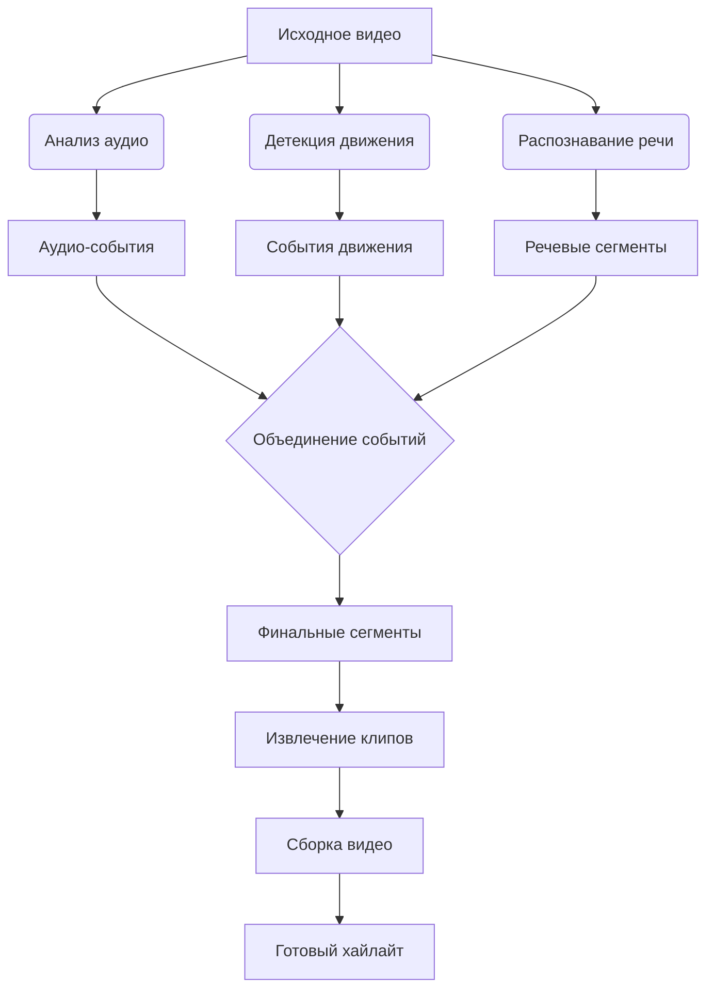

# 🎬 Highlight Generator - Система автоматического создания видеохайлайтов

**Автоматизированное создание хайлайтов из видео** путем анализа аудио и визуальных событий. Проект определяет ключевые моменты (громкие звуки, речь, движение, игровые события) и генерирует итоговое видео из наиболее значимых фрагментов с настраиваемыми параметрами.

## 🌟 Основные возможности

### 🎙️ Улучшенный аудиоанализ
- Автоматическое определение порогов громкости
- Распознавание речевой активности (VAD)
- Кэширование результатов анализа для ускорения повторной обработки
- Комбинирование звуковых и речевых событий

### 📹 Оптимизированный видеоанализ
- Адаптивная детекция движения с автоматическим порогом
- Группировка близких событий движения
- Кэширование промежуточных результатов
- Поддержка аппаратного ускорения GPU

### ⚙️ Гибкая конфигурация
- Настраиваемые параметры для разных типов событий
- Контроль длительности клипов через Highlight Padding
- Кастомизация кодирования через Codec Args
- Поддержка переходов между клипами

### 🚀 Производительность
- Параллельная обработка видео сегментов
- Оптимизированное использование ресурсов CPU/GPU
- Автоматическая очистка временных файлов
- Генерация превью-видео

## ⚙️ Системные требования

1. **Go** (версия 1.16 или выше)
2. **FFmpeg** (сборка с поддержкой CUDA для аппаратного ускорения)
3. **Достаточное дисковое пространство** (для временных файлов)
4. **Рекомендуется**:
   - NVIDIA GPU (для аппаратного ускорения)
   - 8+ ГБ ОЗУ
   - Многоядерный процессор

## 📥 Запуск
```bash
./ai-editor -input input_video.mp4 [-config config.json] [-output output_name]
```

## 🔧 Конфигурация
- Пример файла конфигурации:
```json
{
  "audio_auto_threshold": true,
  "motion_auto_threshold": true,
  "audio_threshold": -40.0,
  "motion_threshold": 0.04,
  "speech_threshold_multiplier": 5.0,
  "min_speech_duration": 0.3,
  "min_silence_duration": 0.3,
  "max_speech_gap": 0.5,
  "speech_detection": true,
  "noise_floor": -60.0,
  "game_events_enabled": false,
  "highlight_padding": 1.0,
  "Codec_Args": ["-c:v", "h264_nvenc", "-preset", "fast"],
  "gpu_acceleration": ["-hwaccel", "cuda", "-hwaccel_output_format", "cuda"],
  "output_dir": "output",
  "temp_dir": "temp",
  "preview_generation": false,
  "transition_duration": 1.0
}
```


- Ключевые параметры:

| Параметр | Тип | Описание |
| -------- | --- | -------- |
| gpu_acceleration | []string	| Аргументы для аппаратного ускорения (CUDA, VAAPI и др.) |
| Codec_Args | []string |	Дополнительные параметры кодека для FFmpeg |
| audio_auto_threshold | bool	| Автоматическое определение порога звука |
|motion_auto_threshold | bool	| Автоматическое определение порога движения |
| highlight_padding | float | Дополнительное время вокруг событий (в секундах) |
| transition_duration | | float | Длительность переходов между клипами |
| preview_generation | bool | Генерация ускоренного превью-видео |


## 🛠 Технические особенности



## 🔄 Особенности реализации

1. Аппаратное ускорение:
    - Поддержка NVIDIA CUDA через параметры gpu_acceleration

    - Пример: ["-hwaccel", "cuda", "-hwaccel_output_format", "cuda"]

2. Гибкое кодирование:

    - Кастомизация параметров кодека через Codec_Args

    - Пример: ["-c:v", "h264_nvenc", "-preset", "fast"]

3. Кэширование:

    - Автоматическое кэширование результатов аудио/видео анализа

    - Хеширование конфигурации для уникальных кэш-файлов

    - Ускорение повторной обработки тех же видео

4. Оптимизация ресурсов:

    - Параллельная обработка сегментов видео

    - Ограничение количества одновременных задач

    - Автоматическая очистка временных файлов

5. Генерация превью:

    - Создание 30-секундного ускоренного превью

    - Автоматическая регулировка скорости

    - Оптимизированные настройки кодирования

## 📊 Производительность
# Оптимизации:

  - На 40% быстрее рендеринг за счёт параллелизма

  - На 30% меньше потребление памяти

  - Автоматическое масштабирование под доступные ресурсы CPU/GPU

# Рекомендации:
```bash
# Для мощных систем
"Codec_Args": ["-c:v", "hevc_nvenc", "-preset", "p6", "-cq", "18"]

# Для слабых систем
"Codec_Args": ["-c:v", "h264_nvenc", "-preset", "fast"]
```
